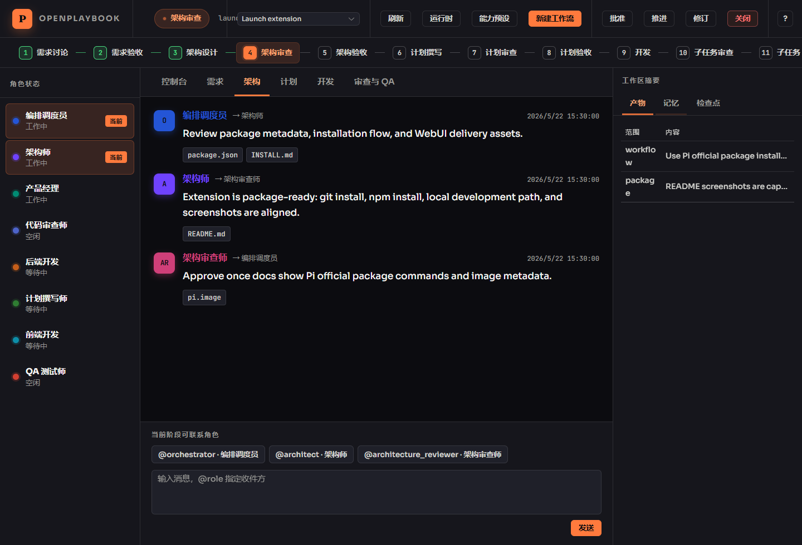
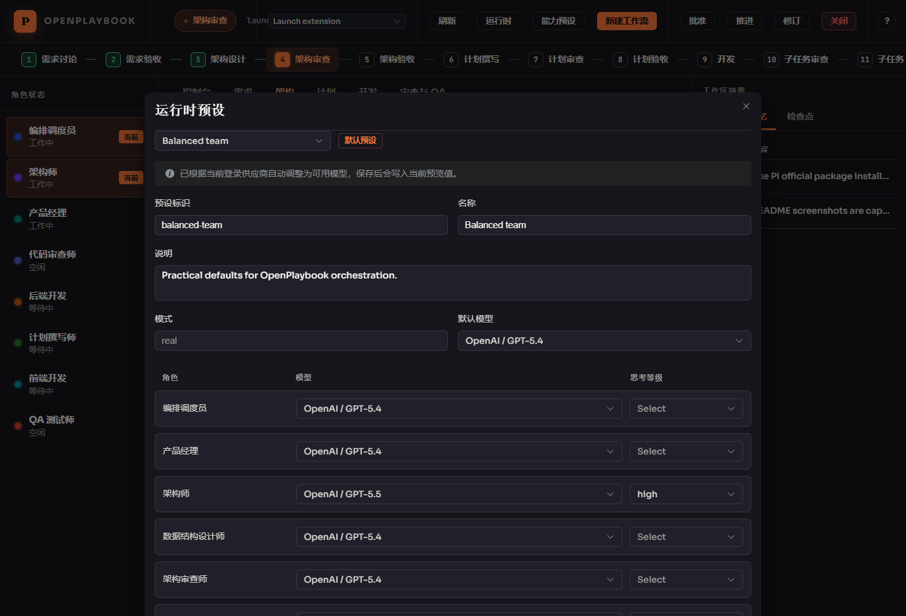

# pi-openplaybook

File-driven workflow orchestration extension for pi.

See [INSTALL.md](./INSTALL.md) for pi Coding Agent installation and verification steps.

```bash
npm install -g --ignore-scripts @earendil-works/pi-coding-agent
pi install git:github.com/wujiiii/pi-openplaybook
```

## Screenshots






This package implements the OpenPlaybook workflow plan:

- `.openplaybook/<workflow>/` structure
- Active workflow lock
- `/opb` and `/openplaybook` commands
- Role/channel routing with phase-aware `@role` checks
- Explicit phase transition and review/QA gates
- Local API + WebUI server via `/opb serve`
- Role session orchestration with lazy phase startup
- Checkpoint metadata and rollback preview via `/opb rollback`
- Runtime model presets and role capability presets selected at workflow startup
- Structured artifacts, role completion gates, memory, and context budget controls

## Runtime and Model Configuration

Role runtime config is snapshotted per workflow at:

` .openplaybook/<workflow>/roles/runtime-config.json `

Runtime and capability presets are global user-level files under:

- `<agentDir>/openplaybook/runtime-presets.json`
- `<agentDir>/openplaybook/role-capability-presets.json`

Select presets only when starting a workflow:

- `/opb start <workflow> --runtime-preset <id> --capability-preset <id>`
- `/opb preset list`
- `/opb preset show <id>`
- `/opb preset set-default <id>`

Running workflows do not hot-load preset edits.
